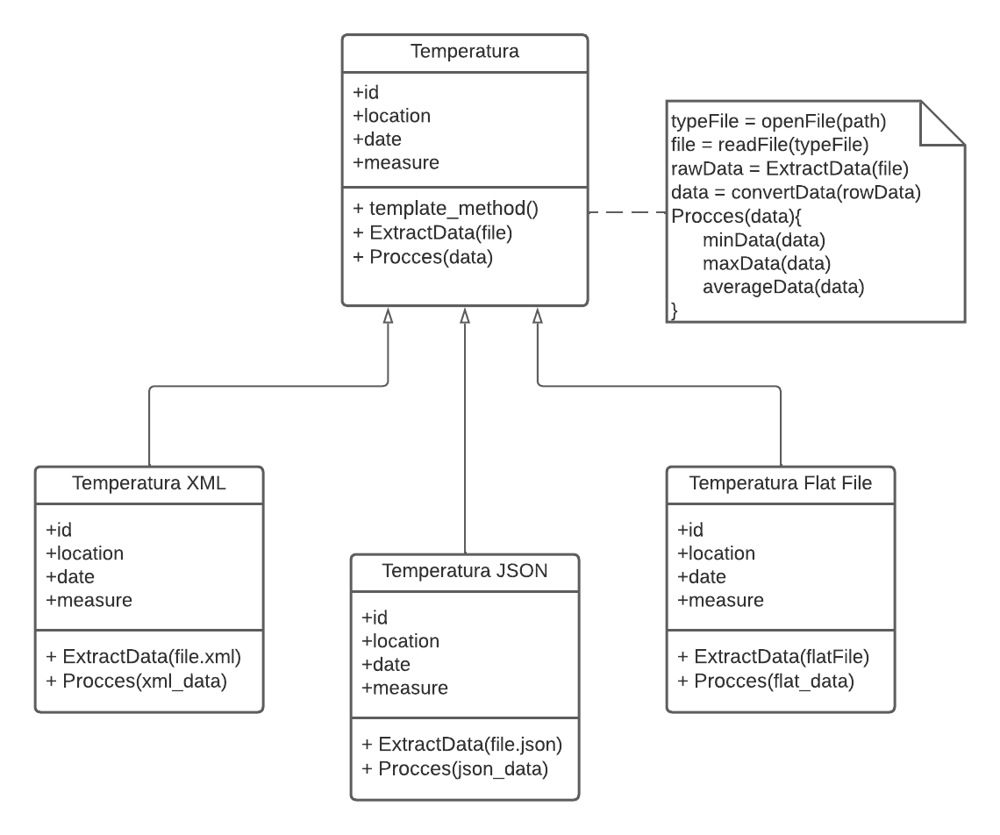

# Temperature-Record-Summary

This is a console application based on **Templated Method** that 
extracts data from different types of files and Calculate the 
minimum, maximum and average of the measurements obtained.

## file Accepted

### Flat File
This application accepts flat files with a .csv extension and the 
structure of this file has to be like the following example:
```csv
Id|Location|Date|Meassure
1|25.5,45.3|2023-05-25|24.5
2|12.7,52.1|2023-02-13|12.7
```
### JSON File
This application also accepts JSON files with .json extension and 
the structure of this file has to be like the following example:
```json
[
	{ 
		"id": 1, 
		"location": "25.5,45.3", 
		"date": "2023-05-25", 
		"meassure": 24.5 
	},
	{ 
		"id": 2, 
		"location": "12.7,52.1", 
		"date": "2023-02-13", 
		"meassure": 12.7 
	}
  ]
```
### XML File
This application also accepts XML files with the .xml extension and 
the structure of this file should be like the following example:
```xml
<?xml version="1.0"?>
<data>
  <row>
    <id>1</id>
    <location>25.5,45.3</location>
    <date>2023-05-25</date>
    <meassure>24.5</meassure>
  </row>
  <row>
    <id>2</id>
    <location>12.7,52.1</location>
    <date>2023-02-13</date>
    <meassure>12.7</meassure>
  </row>
</data>
```
## UML Template Method
UML diagram showing the logic of the program using the template method:
